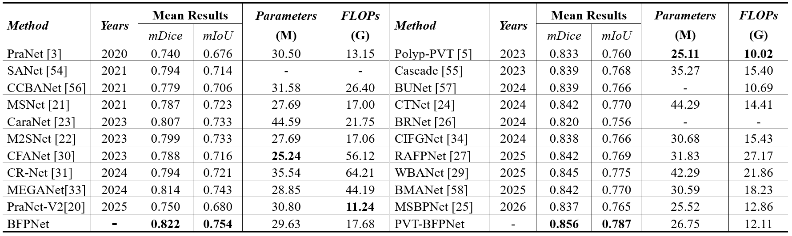
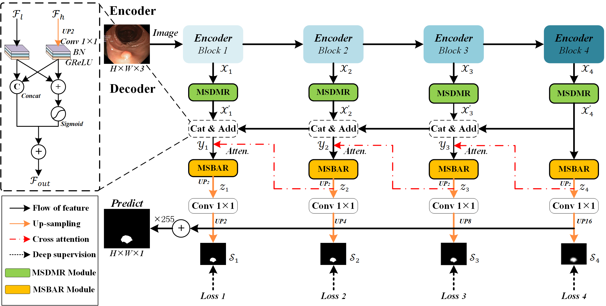
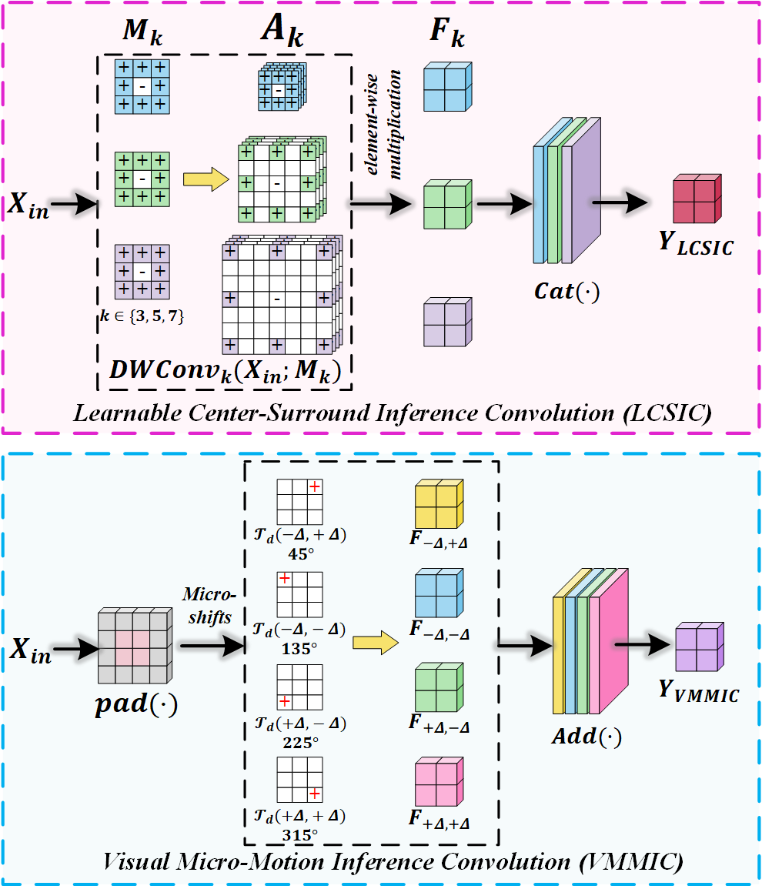
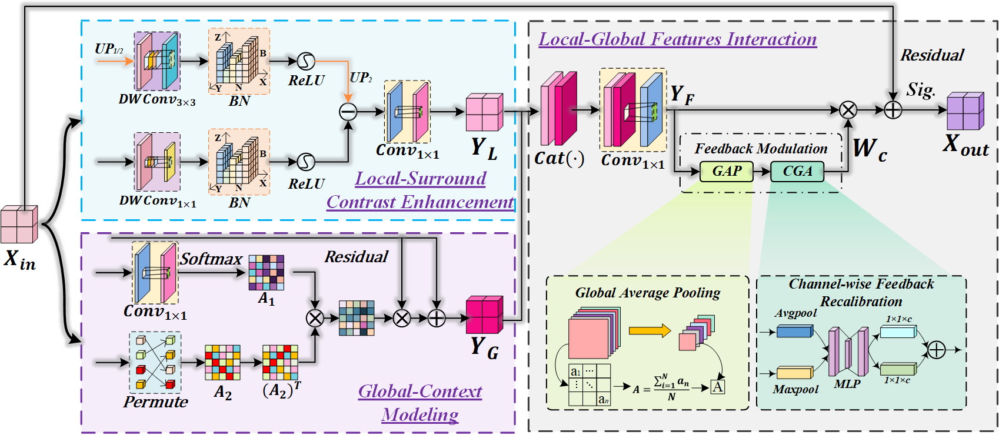
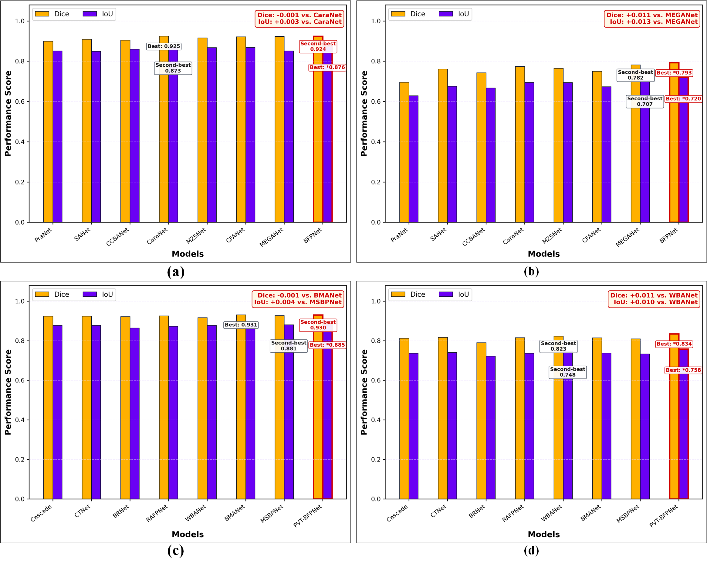

# BFPNet: A Bio-Inspired Feature Perception Network for Polyp Segmentation

Official PyTorch implementation of **A Bio-Inspired Feature Perception Network for Polyp Segmentation**.

BFPNet is a bio-inspired coarse-to-fine segmentation framework for accurate and robust polyp delineation. Instead of physiologically reproducing the biological visual system, BFPNet abstracts selected functional properties of visual perception into a trainable **perception-refinement-regulation** decoder. The same decoder supports both a CNN encoder (**Res2Net-50**) and a Transformer encoder (**PVT-V2-B2**).

**Overall comparison results**

<p align="center">
  
</p>

## Highlights

- **Multi-Scale Dynamic Motion Reduction (MSDMR):** combines multi-scale center-surround inference and constrained directional micro-motion responses to suppress redundant encoder activations while preserving scale-, morphology-, and direction-sensitive information.
- **Multi-Scale Bio-Attentive Refinement (MSBAR):** integrates local-surround contrast enhancement, global-context modeling, and channel-wise feedback recalibration to strengthen structural discrimination and semantic consistency.
- **Hierarchical feedback decoder:** propagates deep semantic information toward shallower reconstruction stages and applies four-level deep supervision for coarse-to-fine prediction.
- **Encoder flexibility:** the shared decoder can be paired with Res2Net-50 (`BFPNet`) or PVT-V2-B2 (`PVT-BFPNet`).
- **Training stability analysis:** an automated ten-seed experiment reports mDice and mIoU as mean +/- sample standard deviation.

## Architecture

Given an input image, the encoder extracts four hierarchical features. Each feature is reduced by MSDMR, progressively integrated from deep to shallow levels, and refined by MSBAR with cross-level semantic feedback. Four full-resolution predictions are supervised during training and aggregated for final segmentation.

<p align="center">
  
</p>

### MSDMR

MSDMR consists of two complementary paths:

1. A multi-scale center-surround path uses neighborhoods of different spatial scales to regulate a shared center representation.
2. A directional micro-motion path produces complementary local responses from constrained spatial directions.

The two paths are adaptively fused to reduce encoder channels while retaining informative polyp structures.

<p align="center">
  
</p>

### MSBAR

MSBAR jointly models local structural contrast and global semantic context. A lightweight channel-feedback operation then recalibrates the fused representation before a residual connection produces the refined output.

<p align="center">
  
</p>

## Paper-reported results

The following results are reported in the revised manuscript. The mean values are weighted by the number of images in each of the five test datasets.

| Model      | Encoder    | Mean mDice | Mean mIoU |  Parameters |       FLOPs |
| ---------- | ---------- | ---------: | --------: | ----------: | ----------: |
| BFPNet     | Res2Net-50 |      0.822 |     0.754 |     29.63 M |     17.68 G |
| PVT-BFPNet | PVT-V2-B2  |  **0.856** | **0.787** | **26.75 M** | **12.11 G** |

Dataset-level overlap results:

| Model      | Metric | CVC-300 | CVC-ClinicDB | CVC-ColonDB | ETIS-LaribPolypDB | Kvasir | Weighted mean |
| ---------- | ------ | ------: | -----------: | ----------: | ----------------: | -----: | ------------: |
| BFPNet     | mDice  |   0.913 |        0.937 |       0.783 |             0.787 |  0.916 |         0.822 |
| BFPNet     | mIoU   |   0.854 |        0.892 |       0.709 |             0.711 |  0.866 |         0.754 |
| PVT-BFPNet | mDice  |   0.910 |        0.945 |       0.839 |             0.813 |  0.920 |         0.856 |
| PVT-BFPNet | mIoU   |   0.850 |        0.903 |       0.762 |             0.735 |  0.874 |         0.787 |


<p align="center">
  
</p>
<p align="center">
  
</p>

## Dataset protocol

Following common polyp-segmentation protocols, the training set contains 1,450 images:

- 900 images from Kvasir;
- 550 images from CVC-ClinicDB.

Evaluation is performed on 798 images from five datasets:

| Dataset           | Images | Role                       |
| ----------------- | -----: | -------------------------- |
| CVC-300           |     60 | Cross-dataset evaluation   |
| CVC-ClinicDB      |     62 | In-distribution evaluation |
| CVC-ColonDB       |    380 | Cross-dataset evaluation   |
| ETIS-LaribPolypDB |    196 | Cross-dataset evaluation   |
| Kvasir            |    100 | In-distribution evaluation |

Arrange the data as follows. Image and mask filenames must correspond after sorting.

```text
dataset/polypImg/
├── TrainDatasets/
│   ├── images/
│   └── masks/
└── TestDataset/
    ├── CVC-300/
    │   ├── images/
    │   └── masks/
    ├── CVC-ClinicDB/
    │   ├── images/
    │   └── masks/
    ├── CVC-ColonDB/
    │   ├── images/
    │   └── masks/
    ├── ETIS-LaribPolypDB/
    │   ├── images/
    │   └── masks/
    └── Kvasir/
        ├── images/
        └── masks/
```

Please download the datasets from their official [Kaggle](https://www.kaggle.com/competitions) or our link [Google Drive](https://drive.google.com/drive/folders/10cqoAKvBQQvsLrqsfWqMuT79JyIgWNMs?usp=sharing).

## Environment

The experiments in the manuscript were conducted with Python 3.8, PyTorch 2.3.x, and an NVIDIA RTX 3090 (24 GB). A recent compatible PyTorch environment can be prepared as follows:

```bash
conda create -n bfpnet python=3.8 -y
conda activate bfpnet

# Install the PyTorch build matching your CUDA runtime first.
pip install torch torchvision

pip install timm numpy opencv-python pillow matplotlib thop
```

The code uses CUDA for training. When multiple GPUs are visible, select one through the environment if needed:

```bash
CUDA_VISIBLE_DEVICES=0 python train.py --help
```

## Pretrained encoders

Place the ImageNet-pretrained encoder weights under `preTrain/`:

```text
preTrain/
├── res2net50_v1b_26w_4s-3cf99910.pth
└── pvt_v2_b2.pth
```

| Encoder               | Target path                                  | Download                                                     |
| --------------------- | -------------------------------------------- | ------------------------------------------------------------ |
| Res2Net-50-v1b-26w-4s | `preTrain/res2net50_v1b_26w_4s-3cf99910.pth` | [Google](https://drive.google.com/file/d/1zo-GxiVvUJSUIIXnBiLOXnRmF3_hGJF1/view?usp=drive_link)  [Bai Du](https://pan.baidu.com/s/17-_pU3gm_XnuPFhClrnXeA?pwd=77ti) |
| PVT-V2-B2             | `preTrain/pvt_v2_b2.pth`                     | [Google](https://drive.google.com/file/d/1PBppj6P3Yhp183oqCeo-30HvdnI7agM5/view?usp=drive_link)  [Bai Du](https://pan.baidu.com/s/17-_pU3gm_XnuPFhClrnXeA?pwd=77ti) |

## Training

The current training entry supports both encoders through `--backbone`. If `--gpu` is omitted, PyTorch uses the current visible/default CUDA device.

### BFPNet with Res2Net-50

```bash
python -u train.py \
  --backbone res2net50 \
  --train_img_dir ./dataset/polypImg/TrainDatasets/images/ \
  --train_gt_dir ./dataset/polypImg/TrainDatasets/masks/ \
  --test_dir ./dataset/polypImg/TestDataset/ \
  --save_model ./model_log/bfpnet_res2net50/
```

### PVT-BFPNet with PVT-V2-B2

```bash
python -u train.py \
  --backbone pvtv2 \
  --pvt_pretrained ./preTrain/pvt_v2_b2.pth \
  --train_img_dir ./dataset/polypImg/TrainDatasets/images/ \
  --train_gt_dir ./dataset/polypImg/TrainDatasets/masks/ \
  --test_dir ./dataset/polypImg/TestDataset/ \
  --save_model ./model_log/pvt_bfpnet/
```

Important defaults in the current code include:

- input resolution: `352 x 352`;
- multi-scale training rates: `0.75`, `1.0`, and `1.25`;
- optimizer: Adam;
- initial learning rate: `1e-4`;
- batch size: `10`;
- training epochs: `100` (`--epoch 101` is an exclusive upper bound);
- structure loss: weighted BCE plus weighted IoU;

The candidate with the highest image-count-weighted five-dataset mDice is selected. Its corresponding mIoU is reported, and its weights are saved as `best.pth`.

### Resume training

Resume from `checkpoint.pth` in the same output directory:

```bash
python -u train.py \
  --backbone res2net50 \
  --seed 3047 \
  --checkpoint_train \
  --save_model ./model_log/bfpnet_res2net50/ \
  --train_img_dir ./dataset/polypImg/TrainDatasets/images/ \
  --train_gt_dir ./dataset/polypImg/TrainDatasets/masks/ \
  --test_dir ./dataset/polypImg/TestDataset/
```

The backbone and seed must match those stored in the checkpoint.

## Inference and mask export

`test.py` exports predicted masks for all five test datasets. Choose the backbone and prediction mode reported for the selected training result.

```bash
python -u test.py \
  --backbone res2net50 \
  --pth_path ./model_log/bfpnet_res2net50/best.pth \
  --test_dir ./dataset/polypImg/TestDataset/ \
  --save_dir ./result_mask/bfpnet/
```

For PVT-BFPNet:

```bash
python -u test.py \
  --backbone pvtv2 \
  --pth_path ./model_log/pvt_bfpnet/best.pth \
  --test_dir ./dataset/polypImg/TestDataset/ \
  --save_dir ./result_mask/pvt_bfpnet/
```

## Repository structure

```text
BFP_Net/
├── lib/
│   ├── modelRes2Net50.py       # BFPNet with Res2Net-50
│   ├── modelPVTv2.py           # PVT-BFPNet with PVT-V2-B2
│   ├── MSDMReduction.py        # MSDMR
│   ├── MSBARefine.py           # MSBAR
│   ├── Conv_Fusion.py          # Cross-level feature fusion
│   ├── res2net_v1b_base.py     # Res2Net implementation/loading
│   ├── pvtv2.py                # PVT-V2 implementation
│   └── loss.py                 # Weighted BCE + weighted IoU loss
├── utils/
│   ├── dataloader.py           # Training augmentation and test loading
│   ├── trainer.py              # Learning-rate utilities
│   └── evaluator.py            # Evaluation utilities
├── preTrain/                   # Encoder checkpoints
├── train.py                    # Training and five-dataset validation
└── test.py                     # Inference and prediction-map export
```

## Pretrained BFPNet checkpoints

| Model                  | Checkpoint | Prediction results |
| ---------------------- | ---------- | --------------- |
| BFPNet (Res2Net-50)    |            |                 |
| PVT-BFPNet (PVT-V2-B2) |            |                 |

## Citation

If this project is useful for your research, please cite the paper. Update the publication fields after the final bibliographic information becomes available.

```bibtex
@article{qiao_bfpnet,
  title   = {A Bio-Inspired Feature Perception Network for Polyp Segmentation},
  author  = {},
  journal = {},
  year    = {},
  note    = {Manuscript under review}
}
```

## Acknowledgements

We thank the authors and maintainers of the public polyp datasets, Res2Net, PVT-V2, and the open-source segmentation methods used for comparison.

## Contact

For questions about the paper or code, please contact:

- Ya-Kun Qiao: `Yakun_Qiao2019@163.com`

